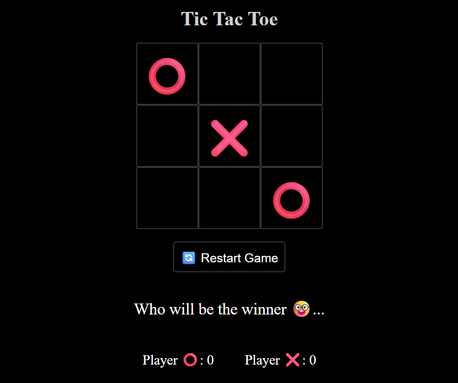

# 🎮 Tic Tac Toe – Game

A fun and interactive Tic Tac Toe game built with **HTML**, **CSS**, and **JavaScript**, featuring emoji-based players ❌ and ⭕. Keep track of wins and enjoy a simple UI with modern styling!

## ✨ Features

- 😄 Emoji-based X and O (❌ / ⭕)
- 🏆 Win count tracker for each player
- 🔄 Restart button to play again
- 🎯 Dynamic message display (winner/turns)
- 🧙‍♂️ Clean and responsive layout

## 📸 Preview

 <!-- Optional: Add your own screenshot image in the repo -->

## 🌐 Live Demo

[Play Now](https://dotsatya.github.io/Tic-Tac-Toe-Game/)
